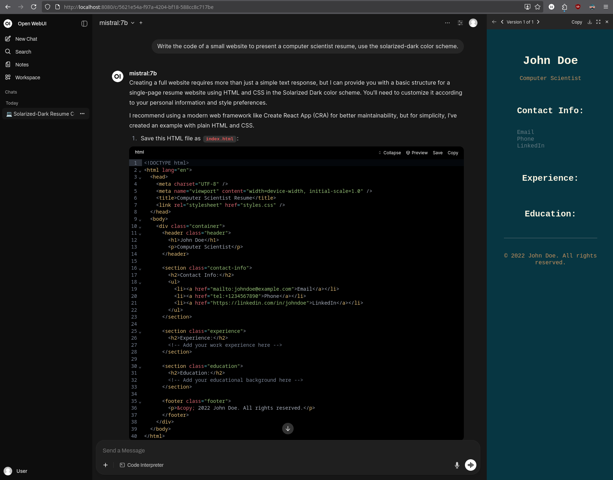

# Ollama and OpenWebUI launcher scripts for Grid'5000

This is a generic launcher script for Ollama and OpenWebUI for Luxembourg compute nodes with AMD GPUs.
Feel free to modify it, propose improvement.

**/!\ Note that it does not implement any security features or authentication.
Handle with care!**

1. Connect to the Luxembourg Grid'5000 site

   ```bash
   (local) $ ssh luxembourg.g5k
   ```

2. Clone this repository in your home directory, and cd into it.

   ```bash
   (fluxembourg) $ git clone https://github.com/hcartiaux/g5k.ai
   (fluxembourg) $ cd g5k.ai
   ```

3. Submit the job, either on `larochette` (4x MI210)

   ```
   (fluxembourg) $ oarsub -S ./launch-larochette.sh
   OAR_JOB_ID=260397
   ```

   Or `vianden` (8x MI310x)

   ```
   (fluxembourg) $ oarsub -S ./launch-vianden.sh
   OAR_JOB_ID=260398
   ```

   You may have to adapt the `OAR` headers in these scripts depending on the compute nodes availability.

4. Look at the output and wait for OpenWebUI to be started and the first model to be downloaded.

   ```
   (fluxembourg) $ multitail -i OAR.<OAR_JOB_iD>.*

   open-webui               |
   open-webui               |  ██████╗ ██████╗ ███████╗███╗   ██╗    ██╗    ██╗███████╗██████╗ ██╗   ██╗██╗
   open-webui               | ██╔═══██╗██╔══██╗██╔════╝████╗  ██║    ██║    ██║██╔════╝██╔══██╗██║   ██║██║
   open-webui               | ██║   ██║██████╔╝█████╗  ██╔██╗ ██║    ██║ █╗ ██║█████╗  ██████╔╝██║   ██║██║
   open-webui               | ██║   ██║██╔═══╝ ██╔══╝  ██║╚██╗██║    ██║███╗██║██╔══╝  ██╔══██╗██║   ██║██║
   open-webui               | ╚██████╔╝██║     ███████╗██║ ╚████║    ╚███╔███╔╝███████╗██████╔╝╚██████╔╝██║
   open-webui               |  ╚═════╝ ╚═╝     ╚══════╝╚═╝  ╚═══╝     ╚══╝╚══╝ ╚══════╝╚═════╝  ╚═════╝ ╚═╝
   open-webui               |
   open-webui               |
   open-webui               | v0.6.26 - building the best AI user interface.
   open-webui               |
   open-webui               | https://github.com/open-webui/open-webui
   open-webui               | INFO:     Started server process [1]

   ollama-model-downloader  | pulling b112e727c6f1: 100% ▕██████████████████▏  13 GB
   ollama-model-downloader  | pulling fa6710a93d78: 100% ▕██████████████████▏ 7.2 KB
   ollama-model-downloader  | pulling f60356777647: 100% ▕██████████████████▏  11 KB
   ollama-model-downloader  | pulling d8ba2f9a17b3: 100% ▕██████████████████▏   18 B
   ollama-model-downloader  | pulling 55c108d8e936: 100% ▕██████████████████▏  489 B
   ollama-model-downloader  | verifying sha256 digest
   ollama-model-downloader  | writing manifest
   ollama-model-downloader  | success
   ollama-model-downloader exited with code 0
   ```

5. Determine which compute node is used, and open a tunnel from your machine.

   ```bash
   (fluxembourg) $ oarstat -Jfj <OAR_JOB_ID> | jq -r '.[] | .assigned_network_address[0]'
   larochette-6.luxembourg.grid5000.fr
   ```

   ```bash
   (local) $ ssh -N -L8080:larochette-6.luxembourg.grid5000.fr:8080 luxembourg.g5k
   ```

   Open your browser and go to [http://localhost:8080/](http://localhost:8080)

   

6. If you want to download other models, connect to the compute node.

   ```bash
   (fluxembourg) $ oarsub -C <OAR_JOB_ID>
   (larochette-6) $ docker exec ollama ollama pull qwen3-coder:30b
   ```
